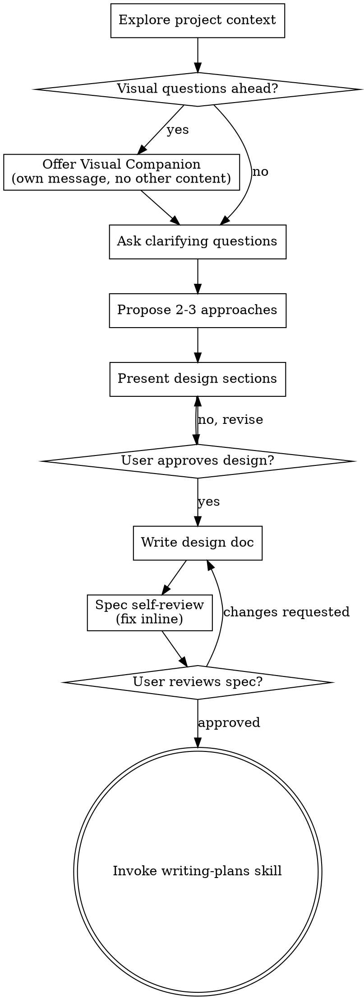

# Jira Brainstorm Integration Implementation Plan

> **For agentic workers:** REQUIRED SUB-SKILL: Use superpowers:subagent-driven-development (recommended) or superpowers:executing-plans to implement this plan task-by-task. Steps use checkbox (`- [ ]`) syntax for tracking.

**Goal:** Extend `skills/brainstorming/SKILL.md` with an optional pre-step that detects a Jira key in the opening brainstorm request, confirms with the user, fetches the ticket via the already-authorized Atlassian Remote MCP server, and presents title + description + recent comments as grounding context before standard brainstorming begins.

**Architecture:** Three surgical edits to a single Markdown file (`skills/brainstorming/SKILL.md`). No code, no new files, no dependencies. The behavior is entirely expressed in prose and a small DOT-graph update that the agent reads and follows. All other brainstorming behavior is preserved verbatim.

**Tech Stack:** Markdown only. The skill assumes the Atlassian Remote MCP server is already connected in the user's IDE (tools `getAccessibleAtlassianResources` and `getJiraIssue` on server `plugin-atlassian-atlassian`). No code is written in this plan.

**Spec:** `docs/superpowers/specs/2026-04-24-jira-brainstorm-integration-design.md` (commit `da6bc87`).

---

## A Note on "Testing" for This Plan

This plan edits behavior-shaping skill content (prose), not code. There is no unit-test harness for skill behavior in this repo, and introducing one is out of scope (spec, Non-Goals).

**Verification is manual.** The "test" for each task is a visual inspection of the resulting `SKILL.md` file. The final end-to-end verification is running the four scenarios from the spec's "Testing" section in a fresh chat.

Every task still gets its own commit so a bad edit can be reverted without losing good ones.

---

## File Structure

**Modified (only one file touched):**
- `skills/brainstorming/SKILL.md` — three localized edits: Checklist (Task 1), Process Flow DOT graph (Task 2), new Jira Integration section (Task 3).

**Already existing (referenced, not modified):**
- `docs/superpowers/specs/2026-04-24-jira-brainstorm-integration-design.md` — the approved design doc.

---

## Task 1: Add checklist item 0

**Files:**
- Modify: `skills/brainstorming/SKILL.md:22-32` (the "Checklist" section)

- [ ] **Step 1: Read the current file once to confirm the exact current content**

Run (via the Read tool, not shell): read `skills/brainstorming/SKILL.md` lines 20-33.

Expected current content of the Checklist section (lines 20-32):

```
## Checklist

You MUST create a task for each of these items and complete them in order:

1. **Explore project context** — check files, docs, recent commits
2. **Offer visual companion** (if topic will involve visual questions) — this is its own message, not combined with a clarifying question. See the Visual Companion section below.
3. **Ask clarifying questions** — one at a time, understand purpose/constraints/success criteria
4. **Propose 2-3 approaches** — with trade-offs and your recommendation
5. **Present design** — in sections scaled to their complexity, get user approval after each section
6. **Write design doc** — save to `docs/superpowers/specs/YYYY-MM-DD-<topic>-design.md` and commit
7. **Spec self-review** — quick inline check for placeholders, contradictions, ambiguity, scope (see below)
8. **User reviews written spec** — ask user to review the spec file before proceeding
9. **Transition to implementation** — invoke writing-plans skill to create implementation plan
```

If the content differs, STOP and report — the spec was written against this exact text and a drift means the plan needs to be re-checked.

- [ ] **Step 2: Replace the checklist with the new version that includes item 0**

Use StrReplace on `skills/brainstorming/SKILL.md`:

`old_string`:

```
You MUST create a task for each of these items and complete them in order:

1. **Explore project context** — check files, docs, recent commits
```

`new_string`:

```
You MUST create a task for each of these items and complete them in order:

0. **Jira key pre-check (optional)** — If the user's initial brainstorm request contains one or more Jira-shaped keys (regex `\b[A-Z][A-Z0-9]+-\d+\b`), ask whether to fetch. On yes, resolve `cloudId` and call `getJiraIssue`; prepend the result as a context block to the brainstorm. See "Jira Integration" section below. If the user declines, skipped silently. If anything fails, acknowledge and continue.
1. **Explore project context** — check files, docs, recent commits
```

- [ ] **Step 3: Verify the edit by re-reading the checklist**

Read `skills/brainstorming/SKILL.md` lines 20-34. Expected new content:

```
## Checklist

You MUST create a task for each of these items and complete them in order:

0. **Jira key pre-check (optional)** — If the user's initial brainstorm request contains one or more Jira-shaped keys (regex `\b[A-Z][A-Z0-9]+-\d+\b`), ask whether to fetch. On yes, resolve `cloudId` and call `getJiraIssue`; prepend the result as a context block to the brainstorm. See "Jira Integration" section below. If the user declines, skipped silently. If anything fails, acknowledge and continue.
1. **Explore project context** — check files, docs, recent commits
2. **Offer visual companion** (if topic will involve visual questions) — this is its own message, not combined with a clarifying question. See the Visual Companion section below.
3. **Ask clarifying questions** — one at a time, understand purpose/constraints/success criteria
4. **Propose 2-3 approaches** — with trade-offs and your recommendation
5. **Present design** — in sections scaled to their complexity, get user approval after each section
6. **Write design doc** — save to `docs/superpowers/specs/YYYY-MM-DD-<topic>-design.md` and commit
7. **Spec self-review** — quick inline check for placeholders, contradictions, ambiguity, scope (see below)
8. **User reviews written spec** — ask user to review the spec file before proceeding
9. **Transition to implementation** — invoke writing-plans skill to create implementation plan
```

Ten items, numbered 0-9. If anything is off, fix it with StrReplace before moving on.

- [ ] **Step 4: Commit**

```bash
cd /home/device42/superpowers
git add skills/brainstorming/SKILL.md
git commit -m "brainstorming: add optional Jira pre-check as checklist item 0"
```

Expected: one file changed, one insertion (the new item 0 line).

---

## Task 2: Update the Process Flow DOT graph to include the Jira pre-check branch

**Files:**
- Modify: `skills/brainstorming/SKILL.md:36-64` (the DOT `digraph brainstorming { ... }` block)

- [ ] **Step 1: Read the current DOT graph block**

Read `skills/brainstorming/SKILL.md` lines 36-64. Expected current content:

```

```

If drift is observed, STOP and report.

- [ ] **Step 2: Replace the DOT graph with the version that includes the Jira pre-check branch**

Use StrReplace on `skills/brainstorming/SKILL.md`.

`old_string`:

```
digraph brainstorming {
    "Explore project context" [shape=box];
    "Visual questions ahead?" [shape=diamond];
    "Offer Visual Companion\n(own message, no other content)" [shape=box];
    "Ask clarifying questions" [shape=box];
    "Propose 2-3 approaches" [shape=box];
    "Present design sections" [shape=box];
    "User approves design?" [shape=diamond];
    "Write design doc" [shape=box];
    "Spec self-review\n(fix inline)" [shape=box];
    "User reviews spec?" [shape=diamond];
    "Invoke writing-plans skill" [shape=doublecircle];

    "Explore project context" -> "Visual questions ahead?";
```

`new_string`:

```
digraph brainstorming {
    "Jira keys in request?" [shape=diamond];
    "User confirms fetch?" [shape=diamond];
    "Fetch via Atlassian MCP\n(getAccessibleAtlassianResources, getJiraIssue)" [shape=box];
    "Present as context block" [shape=box];
    "Explore project context" [shape=box];
    "Visual questions ahead?" [shape=diamond];
    "Offer Visual Companion\n(own message, no other content)" [shape=box];
    "Ask clarifying questions" [shape=box];
    "Propose 2-3 approaches" [shape=box];
    "Present design sections" [shape=box];
    "User approves design?" [shape=diamond];
    "Write design doc" [shape=box];
    "Spec self-review\n(fix inline)" [shape=box];
    "User reviews spec?" [shape=diamond];
    "Invoke writing-plans skill" [shape=doublecircle];

    "Jira keys in request?" -> "User confirms fetch?" [label="yes"];
    "Jira keys in request?" -> "Explore project context" [label="no"];
    "User confirms fetch?" -> "Fetch via Atlassian MCP\n(getAccessibleAtlassianResources, getJiraIssue)" [label="yes"];
    "User confirms fetch?" -> "Explore project context" [label="no"];
    "Fetch via Atlassian MCP\n(getAccessibleAtlassianResources, getJiraIssue)" -> "Present as context block";
    "Present as context block" -> "Explore project context";
    "Explore project context" -> "Visual questions ahead?";
```

This adds four new nodes and six new edges before the existing "Explore project context" node. The existing line `"Explore project context" -> "Visual questions ahead?";` is preserved at the end of the new_string so the graph stays connected to the downstream flow.

- [ ] **Step 3: Verify the edit**

Read `skills/brainstorming/SKILL.md` and find the DOT graph block (search for `digraph brainstorming`). Confirm:
- The graph now has "Jira keys in request?" as the first diamond node.
- "Explore project context" is still present and still flows into "Visual questions ahead?".
- All 11 original node declarations and all 14 original edges are still there unchanged.
- Four new nodes were added: "Jira keys in request?", "User confirms fetch?", "Fetch via Atlassian MCP\n(getAccessibleAtlassianResources, getJiraIssue)", "Present as context block".
- Six new edges were added (the ones listed in Step 2's new_string).

If anything is off, fix it with a targeted StrReplace before moving on.

- [ ] **Step 4: Commit**

```bash
cd /home/device42/superpowers
git add skills/brainstorming/SKILL.md
git commit -m "brainstorming: extend process-flow graph with Jira pre-check branch"
```

Expected: one file changed.

---

## Task 3: Add the "Jira Integration" section to the end of the file

**Files:**
- Modify: `skills/brainstorming/SKILL.md` (append new section after current end of "Visual Companion" section, which currently ends at line 164)

- [ ] **Step 1: Read the tail of the file to confirm the exact insertion point**

Read `skills/brainstorming/SKILL.md` lines 160-165. Expected current content (the tail):

```
If they agree to the companion, read the detailed guide before proceeding:
`skills/brainstorming/visual-companion.md`
```

If the file ends differently (e.g., already has a Jira section, has trailing content after `visual-companion.md`), STOP and report — the spec assumed this was the last content in the file.

- [ ] **Step 2: Append the new "Jira Integration" section at the end of the file**

Use StrReplace on `skills/brainstorming/SKILL.md`.

`old_string`:

```
If they agree to the companion, read the detailed guide before proceeding:
`skills/brainstorming/visual-companion.md`
```

`new_string`:

````
If they agree to the companion, read the detailed guide before proceeding:
`skills/brainstorming/visual-companion.md`

## Jira Integration

An optional pre-step for brainstorming: if the user's initial request names a Jira ticket, fetch the ticket and use it as grounding context before starting the normal brainstorm. Depends on the Atlassian Remote MCP server being connected and authorized in the user's IDE (exposed as server `plugin-atlassian-atlassian`). If it isn't, skip the section entirely and brainstorm from the user's description.

### Recognition & confirmation

- Scan the user's opening brainstorm request with the regex `\b[A-Z][A-Z0-9]+-\d+\b` to find Jira-shaped keys.
- If there are no matches, skip this section entirely. Do not mention Jira.
- If there is one match, ask: *"I see you mentioned `<KEY>`. Want me to fetch it from Jira and include it as context for the brainstorm?"* Only on explicit yes does the next step run.
- If there are multiple matches, list them and ask which to fetch (or all). Cap multi-ticket fetches at 3 per confirmation; if the user wants more, ask them to narrow down or pick in rounds.
- If the user declines, skip silently and continue with standard brainstorming.

### Two-step MCP fetch

1. **Resolve `cloudId` (first Jira fetch in the session only).** Call `getAccessibleAtlassianResources` on server `plugin-atlassian-atlassian`. If one site is returned, use its `id`. If multiple, ask the user which site the ticket lives in. Cache the resolved `cloudId` in conversation context for the rest of the session. Do NOT persist `cloudId` to disk.
2. **Call `getJiraIssue`** on server `plugin-atlassian-atlassian` with:

```json
{
  "cloudId": "<resolved>",
  "issueIdOrKey": "<the-jira-key>",
  "fields": ["summary", "description", "status", "issuetype", "comment"]
}
```

### Field extraction

From the response:
- Title: `fields.summary` (plain string).
- Description: `fields.description` — already pre-rendered to Markdown by the MCP. Use as-is.
- Status name: `fields.status.name`.
- Issue type name: `fields.issuetype.name`.
- Comments: `fields.comment.comments[]`. Sort by `created` descending, take the top 10, then reverse to oldest-first for chronological presentation. Each comment has `author.displayName`, `created` (ISO 8601 — display as `YYYY-MM-DD`), and `body` (ADF JSON; flatten per rules below).

### ADF-to-text flattening (for comment bodies)

Walk the ADF document tree depth-first and emit plain text/Markdown using these rules:

- `text` node → emit its `text` value. If it has a `link` mark, append ` (<href>)` after the text.
- `hardBreak` → `\n`.
- Paragraph boundary → `\n\n` separator between paragraphs.
- `bulletList` item → prefix with `- `, one item per line.
- `orderedList` item → prefix with `1. `, `2. `, … in order.
- `codeBlock` → wrap the inner text in triple-backtick fences.
- `mention` node → `@<displayName>`.
- `emoji` node → the emoji's `shortName` or `text` attribute, whichever is present.
- Any node type not listed → recurse into its `content` and emit inner text only. Tables, panels, and media are included as their contained text with no special formatting.
- If `body` is already a plain string (some servers/responses return that), use it directly without walking.

### Context block format

Present this block in the conversation exactly, filling in the fetched fields. It is the "context" the brainstorming flow will then use as grounding in step 1 (Explore project context):

```
## Jira context: <KEY> (<issuetype name> · <status name>)
Title: <summary>

Description:
<description — already Markdown>

Recent comments (showing <N> of <total>, oldest first):
- [<YYYY-MM-DD> · <author displayName>]: <flattened comment body>
- [<YYYY-MM-DD> · <author displayName>]: <flattened comment body>
...

Note to brainstorming session: Comments on a Jira ticket often include stale ideas, discarded approaches, questions that were never answered, and decisions that were later reversed. Before acting on anything a comment says (especially "we decided to X" or "the approach is Y"), ask the user to confirm the comment is still current and correct. Treat comments as evidence of past discussion, not as requirements.
```

If there are no comments, omit the "Recent comments" subsection entirely (do not print "Recent comments: none"). Still include the "Note to brainstorming session" only if at least one comment was presented.

If the description is missing, print `Description: (empty)` on that line.

### Error handling

Every failure path acknowledges in a single sentence and then continues with standard brainstorming. Never silently retry. Never fabricate ticket content. Use these exact phrasings so behavior is predictable:

- **Atlassian MCP unavailable:** "The Atlassian MCP server isn't responding, so I can't pull the ticket. I'll brainstorm from your description."
- **Auth expired / scope missing:** "Couldn't reach Jira — looks like the Atlassian MCP session needs to be re-authorized. I'll brainstorm from your description; you can re-auth and re-paste the key if you want."
- **Ticket not found / permission denied:** "`<KEY>` either doesn't exist or I don't have permission to read it. I'll brainstorm from your description."
- **Ticket found but description empty AND no comments:** "`<KEY>` has no description or comments yet. I'll brainstorm from your description."
- **Multiple sites available and the user declines to pick:** "No problem — I'll brainstorm from your description without the Jira context."
- **Ticket found with no description but has comments:** proceed normally using just comments. Do not emit any error line.

### Read-only boundary

This skill is read-only by design. Even though the authorized MCP session has `write:jira-work` scope, NEVER call `addCommentToJiraIssue`, `editJiraIssue`, `transitionJiraIssue`, `createJiraIssue`, `addWorklogToJiraIssue`, or `createIssueLink` from this skill. Writing to a ticket is explicitly out of scope; see the design doc's Future Work section.

Future work: write-back capabilities are out of scope — see the design doc's Future Work section.
````

- [ ] **Step 3: Verify the edit**

Read `skills/brainstorming/SKILL.md` and confirm:
- The file still starts with the frontmatter (`---\nname: brainstorming\n...\n---`) and the title `# Brainstorming Ideas Into Designs`.
- The Checklist section still contains items 0 through 9 (from Task 1).
- The DOT graph still contains "Jira keys in request?" as its first diamond (from Task 2).
- The Visual Companion section is still intact.
- The new "## Jira Integration" section appears after Visual Companion and contains all six subsections listed above: Recognition & confirmation, Two-step MCP fetch, Field extraction, ADF-to-text flattening, Context block format, Error handling, Read-only boundary.
- The file does NOT contain any "TBD", "TODO", "..." as a real placeholder, or instructions like "fill in later".

- [ ] **Step 4: Run ReadLints to catch any Markdown-level issues introduced**

Run ReadLints on `skills/brainstorming/SKILL.md`. Expected: no new errors. If any markdown lint flags were already present on the file, leave them alone; only fix issues your edits introduced.

- [ ] **Step 5: Commit**

```bash
cd /home/device42/superpowers
git add skills/brainstorming/SKILL.md
git commit -m "brainstorming: add Jira Integration section with MCP fetch and error handling"
```

Expected: one file changed.

---

## Task 4: End-to-end manual verification (the 4 scenarios from the spec)

**Files:**
- None modified. This task is verification only.

- [ ] **Step 1: Positive case — ticket with description and comments**

Open a fresh chat session in Cursor with this repo as the workspace. Type:

```
Let's brainstorm on D42-44517
```

Expected behavior:
1. The agent identifies the key `D42-44517` via the regex.
2. The agent asks: *"I see you mentioned `D42-44517`. Want me to fetch it from Jira and include it as context for the brainstorm?"*
3. On "yes", the agent calls `getAccessibleAtlassianResources`, then `getJiraIssue`.
4. A context block appears in the conversation matching the format in "Context block format", with the real title, description, up to 10 comments (oldest-first), and the "Note to brainstorming session".
5. The agent then proceeds to step 1 of the checklist (Explore project context) and continues the normal brainstorming flow.

If any step deviates, file a fix-up task or revert to main.

- [ ] **Step 2: No Jira key case**

Fresh chat. Type:

```
Let's brainstorm about improving our discovery pipeline
```

Expected behavior: The agent does not mention Jira, does not ask any confirmation question about a Jira fetch, and proceeds directly to step 1 (Explore project context).

- [ ] **Step 3: User declines the fetch**

Fresh chat. Type:

```
Let's brainstorm on D42-44517
```

When the agent asks the confirmation question, reply:

```
no
```

Expected behavior: The agent skips the fetch silently (no error, no retry) and proceeds directly to step 1 (Explore project context) using only the user's framing.

- [ ] **Step 4: Invalid / nonexistent ticket**

Fresh chat. Type:

```
Let's brainstorm on ZZZZZ-999999
```

When the agent asks the confirmation question, reply:

```
yes
```

Expected behavior: The agent attempts the fetch, gets the "Issue does not exist or you do not have permission to see it" error from the MCP, emits the exact error phrasing *"`ZZZZZ-999999` either doesn't exist or I don't have permission to read it. I'll brainstorm from your description."*, then proceeds to step 1.

- [ ] **Step 5: No commit for this task**

This task does not produce any git changes. If all four scenarios pass, the implementation is complete and the earlier three task commits stand.

If any scenario fails, create a fix-up commit addressing only the failing scenario — do not bundle fixes for multiple scenarios into one commit unless they share a root cause.

---

## Self-Review (against the spec)

This section is the author's self-review of the plan against the spec. Each checklist item verifies spec coverage.

### Spec coverage check

| Spec requirement | Plan task implementing it |
|------------------|---------------------------|
| Checklist item 0 added to `SKILL.md` (spec Edit 1) | Task 1 |
| DOT graph updated with pre-check branch (spec Edit 2) | Task 2 |
| New Jira Integration section at end of file (spec Edit 3) | Task 3 |
| Recognition regex `\b[A-Z][A-Z0-9]+-\d+\b` | Task 1 step 2, Task 3 step 2 (Recognition & confirmation subsection) |
| Confirmation phrasing | Task 3 step 2 (Recognition & confirmation) |
| Multi-ticket cap at 3 | Task 3 step 2 (Recognition & confirmation) |
| Two-step MCP fetch with exact argument shape | Task 3 step 2 (Two-step MCP fetch) |
| Field extraction (summary, description, status, issuetype, 10 most recent comments oldest-first) | Task 3 step 2 (Field extraction) |
| Description used as-is (already Markdown) | Task 3 step 2 (Field extraction + ADF rule about plain-string fallback) |
| ADF-to-text flattening rules for comment bodies | Task 3 step 2 (ADF-to-text flattening) |
| Context block format with staleness note | Task 3 step 2 (Context block format) |
| Error-handling catalog (6 cases) | Task 3 step 2 (Error handling) |
| Read-only boundary | Task 3 step 2 (Read-only boundary) |
| `cloudId` cached per session, never persisted | Task 3 step 2 (Two-step MCP fetch) |
| Manual 4-scenario test | Task 4 |
| Rollback via single `git revert` | Implicit: three separate commits (Tasks 1-3) each revertable individually |

No spec gaps detected.

### Placeholder scan

No "TBD", "TODO", "fill in later", "implement later", or equivalent placeholders in actionable steps. Angle-bracket tokens (`<KEY>`, `<YYYY-MM-DD>`, `<the-jira-key>`, `<resolved>`) appear only inside format-template quoted text meant to be filled at runtime by the agent, not at plan-execution time. That is the same convention the spec uses and it is intentional.

### Type / name consistency

- Tool names used consistently: `getAccessibleAtlassianResources`, `getJiraIssue`. No drift.
- Server name used consistently: `plugin-atlassian-atlassian`. No drift.
- Field paths used consistently: `fields.summary`, `fields.description`, `fields.status.name`, `fields.issuetype.name`, `fields.comment.comments[]`. No drift.
- Error phrasings match verbatim between spec error table and Task 3's Error handling subsection.
- Recognition regex is identical everywhere it appears: `\b[A-Z][A-Z0-9]+-\d+\b`.

No consistency issues found.

---

## Notes for the Implementing Agent

- **One task at a time.** Tasks 1, 2, and 3 each produce their own commit. Do not batch them into a single commit, because if one edit breaks the skill, you want to revert only that one.
- **Read before editing, every time.** The pattern in every edit task is Read → Plan the StrReplace → StrReplace → Read again to verify. If the file content drifts from the expected state (someone else edited in parallel, a prior task didn't apply cleanly, etc.), STOP and report rather than trying to recover on the fly.
- **No renaming / reformatting.** Do not adjust indentation, reflow paragraphs, or change other parts of the file. The spec explicitly says all existing content is preserved verbatim.
- **Do not touch any other skill file.** The scope of this plan is exactly one file: `skills/brainstorming/SKILL.md`. If you find yourself wanting to edit `skills/writing-plans/SKILL.md` or any other skill to "make it consistent", STOP — that is scope creep and needs a separate design.
- **Verification is visual.** After each task's Step 3 (the "Verify" step), a human reviewer can diff the commit to confirm the change matches the spec. The implementing agent should run ReadLints only on the modified file, not the repo-wide lints.
