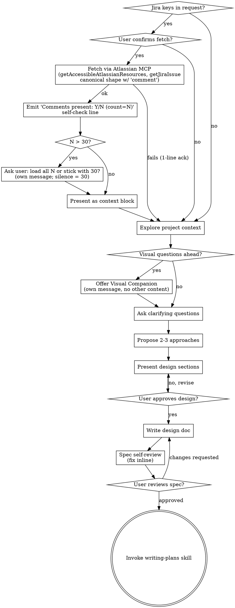

# Brainstorming Ideas Into Designs

Help turn ideas into fully formed designs and specs through natural collaborative dialogue.

Start by understanding the current project context, then ask questions one at a time to refine the idea. Once you understand what you're building, present the design and get user approval.

<HARD-GATE>
Do NOT invoke any implementation skill, write any code, scaffold any project, or take any implementation action until you have presented a design and the user has approved it. This applies to EVERY project regardless of perceived simplicity.
</HARD-GATE>

## Anti-Pattern: "This Is Too Simple To Need A Design"

Every project goes through this process. A todo list, a single-function utility, a config change — all of them. "Simple" projects are where unexamined assumptions cause the most wasted work. The design can be short (a few sentences for truly simple projects), but you MUST present it and get approval.

## Checklist

You MUST create a task for each of these items and complete them in order:

0. **Jira key pre-check (optional)** — If the user's initial brainstorm request contains one or more Jira-shaped keys (regex `\b[A-Z][A-Z0-9]+-\d+\b`), ask whether to fetch. On yes, resolve `cloudId` and call `getJiraIssue` using **the canonical call** in the "Jira Integration" section below — no other `fields` lists, no omitted-`fields` variant. If the user declines, skip silently. If anything fails, acknowledge and continue.
1. **Explore project context** — check files, docs, recent commits
2. **Offer visual companion** (if topic will involve visual questions) — this is its own message, not combined with a clarifying question. See the Visual Companion section below.
3. **Ask clarifying questions** — one at a time, understand purpose/constraints/success criteria
4. **Propose 2-3 approaches** — with trade-offs and your recommendation
5. **Present design** — in sections scaled to their complexity, get user approval after each section
6. **Write design doc** — save to `docs/superpowers/specs/YYYY-MM-DD-<topic>-design.md` and commit
7. **Spec self-review** — quick inline check for placeholders, contradictions, ambiguity, scope (see below)
8. **User reviews written spec** — ask user to review the spec file before proceeding
9. **Transition to implementation** — invoke writing-plans skill to create implementation plan

## Process Flow



**The terminal state is invoking writing-plans.** Do NOT invoke frontend-design, mcp-builder, or any other implementation skill. The ONLY skill you invoke after brainstorming is writing-plans.

## The Process

**Understanding the idea:**

- Check out the current project state first (files, docs, recent commits)
- Before asking detailed questions, assess scope: if the request describes multiple independent subsystems (e.g., "build a platform with chat, file storage, billing, and analytics"), flag this immediately. Don't spend questions refining details of a project that needs to be decomposed first.
- If the project is too large for a single spec, help the user decompose into sub-projects: what are the independent pieces, how do they relate, what order should they be built? Then brainstorm the first sub-project through the normal design flow. Each sub-project gets its own spec → plan → implementation cycle.
- For appropriately-scoped projects, ask questions one at a time to refine the idea
- Prefer multiple-choice questions when possible, but open-ended is fine too
- **When a question is multiple-choice (≥2 distinct options), use your platform's structured-question / multiple-choice tool — do NOT emit the options as plain numbered text.** On Cursor that tool is `AskQuestion`; other agent platforms expose an equivalent (Copilot's `ask_question`, Codex's interactive prompt, etc.). If your platform has no such tool, fall back to a plain numbered list. The structured tool is preferred because it gives the user a clickable UI instead of forcing them to type "2" or paste an option label, and it removes ambiguity about which option was picked.
- Only one question per message — if a topic needs more exploration, break it into multiple questions (or, when using a structured-question tool that supports multiple questions per call, you may batch *closely-related* questions in a single call, but keep each question itself focused)
- Focus on understanding: purpose, constraints, success criteria

**Exploring approaches:**

- Propose 2-3 different approaches with trade-offs
- Present options conversationally with your recommendation and reasoning
- Lead with your recommended option and explain why

**Presenting the design:**

- Once you believe you understand what you're building, present the design
- Scale each section to its complexity: a few sentences if straightforward, up to 200-300 words if nuanced
- Ask after each section whether it looks right so far
- Cover: architecture, components, data flow, error handling, testing
- Be ready to go back and clarify if something doesn't make sense

**Design for isolation and clarity:**

- Break the system into smaller units that each have one clear purpose, communicate through well-defined interfaces, and can be understood and tested independently
- For each unit, you should be able to answer: what does it do, how do you use it, and what does it depend on?
- Can someone understand what a unit does without reading its internals? Can you change the internals without breaking consumers? If not, the boundaries need work.
- Smaller, well-bounded units are also easier for you to work with - you reason better about code you can hold in context at once, and your edits are more reliable when files are focused. When a file grows large, that's often a signal that it's doing too much.

**Working in existing codebases:**

- Explore the current structure before proposing changes. Follow existing patterns.
- Where existing code has problems that affect the work (e.g., a file that's grown too large, unclear boundaries, tangled responsibilities), include targeted improvements as part of the design - the way a good developer improves code they're working in.
- Don't propose unrelated refactoring. Stay focused on what serves the current goal.

## After the Design

**Documentation:**

- Write the validated design (spec) to `docs/superpowers/specs/YYYY-MM-DD-<topic>-design.md`
  - (User preferences for spec location override this default)
- Use elements-of-style:writing-clearly-and-concisely skill if available
- Commit the design document to git

**Spec Self-Review:**
After writing the spec document, look at it with fresh eyes:

1. **Placeholder scan:** Any "TBD", "TODO", incomplete sections, or vague requirements? Fix them.
2. **Internal consistency:** Do any sections contradict each other? Does the architecture match the feature descriptions?
3. **Scope check:** Is this focused enough for a single implementation plan, or does it need decomposition?
4. **Ambiguity check:** Could any requirement be interpreted two different ways? If so, pick one and make it explicit.

Fix any issues inline. No need to re-review — just fix and move on.

**User Review Gate:**
After the spec review loop passes, ask the user to review the written spec before proceeding:

> "Spec written and committed to `<path>`. Please review it and let me know if you want to make any changes before we start writing out the implementation plan."

Wait for the user's response. If they request changes, make them and re-run the spec review loop. Only proceed once the user approves.

**Implementation:**

- Invoke the writing-plans skill to create a detailed implementation plan
- Do NOT invoke any other skill. writing-plans is the next step.

## Key Principles

- **One question at a time** - Don't overwhelm with multiple questions
- **Multiple choice preferred** - Easier to answer than open-ended when possible
- **Structured-question UI for multiple-choice** - When the question has ≥2 distinct options, use your platform's structured-question tool (Cursor: `AskQuestion`; other platforms: equivalent) so the user gets a clickable UI. Plain numbered text is the fallback only when no such tool exists.
- **YAGNI ruthlessly** - Remove unnecessary features from all designs
- **Explore alternatives** - Always propose 2-3 approaches before settling
- **Incremental validation** - Present design, get approval before moving on
- **Be flexible** - Go back and clarify when something doesn't make sense

## Visual Companion

A browser-based companion for showing mockups, diagrams, and visual options during brainstorming. Available as a tool — not a mode. Accepting the companion means it's available for questions that benefit from visual treatment; it does NOT mean every question goes through the browser.

**Offering the companion:** When you anticipate that upcoming questions will involve visual content (mockups, layouts, diagrams), offer it once for consent:
> "Some of what we're working on might be easier to explain if I can show it to you in a web browser. I can put together mockups, diagrams, comparisons, and other visuals as we go. This feature is still new and can be token-intensive. Want to try it? (Requires opening a local URL)"

**This offer MUST be its own message.** Do not combine it with clarifying questions, context summaries, or any other content. The message should contain ONLY the offer above and nothing else. Wait for the user's response before continuing. If they decline, proceed with text-only brainstorming.

**Per-question decision:** Even after the user accepts, decide FOR EACH QUESTION whether to use the browser or the terminal. The test: **would the user understand this better by seeing it than reading it?**

- **Use the browser** for content that IS visual — mockups, wireframes, layout comparisons, architecture diagrams, side-by-side visual designs
- **Use the terminal** for content that is text — requirements questions, conceptual choices, tradeoff lists, A/B/C/D text options, scope decisions

A question about a UI topic is not automatically a visual question. "What does personality mean in this context?" is a conceptual question — use the terminal. "Which wizard layout works better?" is a visual question — use the browser.

If they agree to the companion, read the detailed guide before proceeding:
`skills/brainstorming/visual-companion.md`

## Jira Integration

An optional pre-step for brainstorming: if the user's initial request names a Jira ticket, fetch the ticket and use it as grounding context before starting the normal brainstorm. Depends on the Atlassian Remote MCP server being connected and authorized in the user's IDE (exposed as server `plugin-atlassian-atlassian`). If it isn't, skip the section entirely and brainstorm from the user's description.

**Practical rule (ticket-driven brainstorms):** Load issue summary, description, and comments (and linked docs if referenced) before asking clarifying questions or proposing approaches.

### `getJiraIssue` and the `fields` parameter (read this — other skills are easy to misfire with)

- Other skills may describe `getJiraIssue(cloudId, issueIdOrKey)` **with no `fields` argument** as returning "full issue" content — including description, **comments**, and status. **That is wrong for this MCP.** Under the hood the call maps to Jira Cloud's `GET /rest/api/3/issue/{key}`, whose default is `*navigable` fields — and `comment` is **not** in the navigable set. Empirically, omitting `fields` has returned payloads with **no comment thread** on tickets that have dozens of comments. Do not trust an "omit `fields` for full issue" instruction from any other skill.
- **If you pass a `fields` array, the API returns ONLY those ids.** A custom `fields` list that omits `comment` is not a bug — Jira correctly returns no comment data. The brainstorming failure mode is: you copied a "minimal" field list, left out `comment`, and assumed "full issue" still applied. **It does not.**
- **`responseContentFormat` matters too.** The MCP defaults to ADF JSON for rich-text fields when `responseContentFormat` is omitted. The canonical call below passes `"responseContentFormat": "markdown"` so the top-level `fields.description` comes back pre-rendered; without it you will get raw ADF and have to flatten descriptions the same way you flatten comment bodies.
- **This skill wins over generic Atlassian/company-knowledge phrasing in ticket-driven brainstorms.** There is exactly **ONE** call shape for this step — the canonical call in "Two-step MCP fetch" below, with `fields: ["summary", "description", "status", "issuetype", "comment"]` and `responseContentFormat: "markdown"`. Any other `fields` array, any call that omits `fields` entirely, and any call that forgets `responseContentFormat: "markdown"` are all **out of spec**.

### Recognition & confirmation

- Scan the user's opening brainstorm request with the regex `\b[A-Z][A-Z0-9]+-\d+\b` to find Jira-shaped keys.
- If there are no matches, skip this section entirely. Do not mention Jira.
- If there is one match, ask: *"I see you mentioned `<KEY>`. Want me to fetch it from Jira and include it as context for the brainstorm?"* Only on explicit yes does the next step run.
- If there are multiple matches, list them and ask which to fetch (or all). Cap multi-ticket fetches at 3 per confirmation; if the user wants more, ask them to narrow down or pick in rounds.
- If the user declines, skip silently and continue with standard brainstorming.

### Two-step MCP fetch

1. **Resolve `cloudId` (first Jira fetch in the session only).** Call `getAccessibleAtlassianResources` on server `plugin-atlassian-atlassian`. If one site is returned, use its `id`. If multiple, ask the user which site the ticket lives in. Cache the resolved `cloudId` in conversation context for the rest of the session. Do NOT persist `cloudId` to disk.
2. **Call `getJiraIssue`** on server `plugin-atlassian-atlassian` using **the canonical call shape below** — this is the ONLY permitted shape for this step. The `fields` list MUST contain all five ids (including `comment`) and `responseContentFormat` MUST be `"markdown"` (the MCP defaults to ADF otherwise, which breaks the "description is already Markdown" assumption used by the Field extraction step below). There is no "omit `fields` for full issue" alternative — see the preceding subsection for why.

**Canonical call — copy `fields` verbatim; do not edit the list, do not substitute a "smaller" or "more complete" set, do not drop `comment`:**

```json
{
  "cloudId": "<resolved>",
  "issueIdOrKey": "<the-jira-key>",
  "fields": ["summary", "description", "status", "issuetype", "comment"],
  "responseContentFormat": "markdown"
}
```

**Out of spec (any of these is a misfire — self-correct as described below):**
- Any other `fields` array, including the "minimal" set (`summary` + `description` + `status` + `issuetype` with `comment` dropped).
- Omitting `fields` entirely. This used to be an explicitly-allowed "shape A" and is no longer — the MCP's default `fields` does not include `comment`, so comments come back missing.
- Omitting `responseContentFormat: "markdown"`.

If you have already called `getJiraIssue` incorrectly, acknowledge the mistake in one sentence to the user and re-call with the canonical shape above before building the Jira context block.

**Comment completeness (mandatory before you build the Jira context block):**

This is a visible forcing function, not an internal check. The user must see evidence that you looked.

1. **Inspect the payload for the comment collection** — locate `fields.comment` (the canonical call shape above guarantees it will be in the returned object if the call succeeded). Count the entries (`fields.comment.comments.length`, or equivalent if the MCP renames it). Call this count `N`.
2. **Emit the self-check line to the user** in the conversation, as its own line, immediately before the Jira context block. Use this exact format:

    ```
    Comments present: <YES|NO> (count=<N>)
    ```

   - `YES` when the comment collection exists and `N >= 1`.
   - `NO` when the comment collection exists and `N == 0` (an un-commented issue — valid; proceed).
   - If the comment collection is **missing** from the payload at all, do **not** print `NO` and proceed — that means the call was out of spec. Instead, acknowledge the misfire in one sentence (see next bullet) and re-call.
3. **Ask about load size when `N > 30`.** The Field extraction step below defaults to the 30 most recent comments. If `N > 30`, before building the context block, ask the user — as its own message, not combined with clarifying questions — whether to load all `N`. Use this exact phrasing (fill in the number):

    > "This ticket has `<N>` comments. The default is to load the 30 most recent. Loading all `<N>` gives fuller context but uses more tokens. Want me to load all `<N>`?"

   Wait for the user's answer. Then:
   - **Explicit "yes" / "load all" / equivalent affirmative** → load all `N` comments in Field extraction below. Record this choice as `load_all = true` for the rest of this ticket's context build.
   - **Explicit "no" / "just 30" / equivalent negative** → load 30. `load_all = false`.
   - **Silence, ambiguous answer, or off-topic reply** → default to 30 (`load_all = false`). Do not re-prompt; the user can always ask later to see more.

   When `N <= 30`, skip this step entirely — there is nothing to ask. Do not mention the 30 cap unless it matters.
4. **Self-correction on misfire.** If you realize you called `getJiraIssue` with the wrong `fields` (missing `comment`, missing entirely, or without `responseContentFormat: "markdown"`), acknowledge the slip-up in one sentence to the user and re-call with the canonical shape before presenting context. The user sees the acknowledgement line — it is never a silent retry.
5. **Last-resort fallback (Jira Cloud REST background):** `GET /rest/api/3/issue/{issueIdOrKey}/comment` lists comments directly; in this MCP, the canonical `getJiraIssue` call with `comment` in `fields` is the normal path. If, after a correct canonical call, comment data is still missing and you have no read-only way to load it, state that in one sentence and continue from title and description.

### Field extraction

From the response:
- Title: `fields.summary` (plain string).
- Description: `fields.description` — already pre-rendered to Markdown by the MCP. Use as-is.
- Status name: `fields.status.name`.
- Issue type name: `fields.issuetype.name`.
- Comments: `fields.comment.comments[]`. Sort by `created` descending, then take the top `K` where **`K = total` if the user opted to load all (`load_all = true` from the Comment completeness step) and `K = min(30, total)` otherwise**. Reverse the selected slice to oldest-first for chronological presentation. Each comment has `author.displayName`, `created` (ISO 8601 — display as `YYYY-MM-DD`), and `body` (ADF JSON; flatten per rules below).

### ADF-to-text flattening (for comment bodies)

Walk the ADF document tree depth-first and emit plain text/Markdown using these rules:

- `text` node → emit its `text` value. If it has a `link` mark, append ` (<href>)` after the text.
- `hardBreak` → `\n`.
- Paragraph boundary → `\n\n` separator between paragraphs.
- `bulletList` item → prefix with `- `, one item per line.
- `orderedList` item → prefix with `1. `, `2. `, … in order.
- `codeBlock` → wrap the inner text in triple-backtick fences.
- `mention` node → `@<displayName>`.
- `emoji` node → the emoji's `shortName` or `text` attribute, whichever is present.
- Any node type not listed → recurse into its `content` and emit inner text only. Tables, panels, and media are included as their contained text with no special formatting.
- If `body` is already a plain string (some servers/responses return that), use it directly without walking.

### Context block format

Present this block in the conversation exactly, filling in the fetched fields. It is the "context" the brainstorming flow will then use as grounding in step 1 (Explore project context).

**Order of emission:** the `Comments present: …` self-check line from the Comment completeness section above MUST come immediately before the `## Jira context:` heading, on its own line, separated from the heading by a single blank line. The check line is part of the output the user sees, not an internal note.

```
Comments present: <YES|NO> (count=<N>)

## Jira context: <KEY> (<issuetype name> · <status name>)
Title: <summary>

Description:
<description — already Markdown>

<recent-comments-subsection-if-any>

<staleness-note-if-recent-comments-subsection-was-emitted>
```

**Each `<...>` placeholder includes its own leading/trailing blank lines.** When a placeholder is omitted (zero comments → omit both the subsection AND the staleness note), collapse any adjacent blank lines too, so the rendered block ends cleanly at `Description:` instead of trailing whitespace.

**Recent comments subsection** — emit ONLY if at least one comment is being presented:

```
Recent comments (showing <N> of <total>, oldest first):
- [<YYYY-MM-DD> · <author displayName>]: <flattened comment body>
- [<YYYY-MM-DD> · <author displayName>]: <flattened comment body>
...
```

If the issue has zero comments, omit this entire subsection (do not print "Recent comments: none").

**Staleness note** — emit ONLY if the Recent comments subsection was emitted:

```
Note to brainstorming session: Comments on a Jira ticket often include stale ideas, discarded approaches, questions that were never answered, and decisions that were later reversed. Before acting on anything a comment says (especially "we decided to X" or "the approach is Y"), ask the user to confirm the comment is still current and correct. Treat comments as evidence of past discussion, not as requirements.
```

If the description is missing, print `Description: (empty)` on that line.

### Error handling

Every failure path acknowledges in a single sentence and then continues with standard brainstorming. Never silently retry. Never fabricate ticket content. Use these exact phrasings so behavior is predictable:

- **Atlassian MCP unavailable:** "The Atlassian MCP server isn't responding, so I can't pull the ticket. I'll brainstorm from your description."
- **Auth expired / scope missing:** "Couldn't reach Jira — looks like the Atlassian MCP session needs to be re-authorized. I'll brainstorm from your description; you can re-auth and re-paste the key if you want."
- **Ticket not found / permission denied:** "`<KEY>` either doesn't exist or I don't have permission to read it. I'll brainstorm from your description."
- **Ticket found but description empty AND no comments:** "`<KEY>` has no description or comments yet. I'll brainstorm from your description."
- **Multiple sites available and the user declines to pick:** "No problem — I'll brainstorm from your description without the Jira context."
- **Ticket found with no description but has comments:** proceed normally using just comments. Do not emit any error line.

### Read-only boundary

This skill is read-only by design. Even though the authorized MCP session has `write:jira-work` scope, NEVER call `addCommentToJiraIssue`, `editJiraIssue`, `transitionJiraIssue`, `createJiraIssue`, `addWorklogToJiraIssue`, or `createIssueLink` from this skill. Writing to a ticket is explicitly out of scope; see the design doc's Future Work section.
